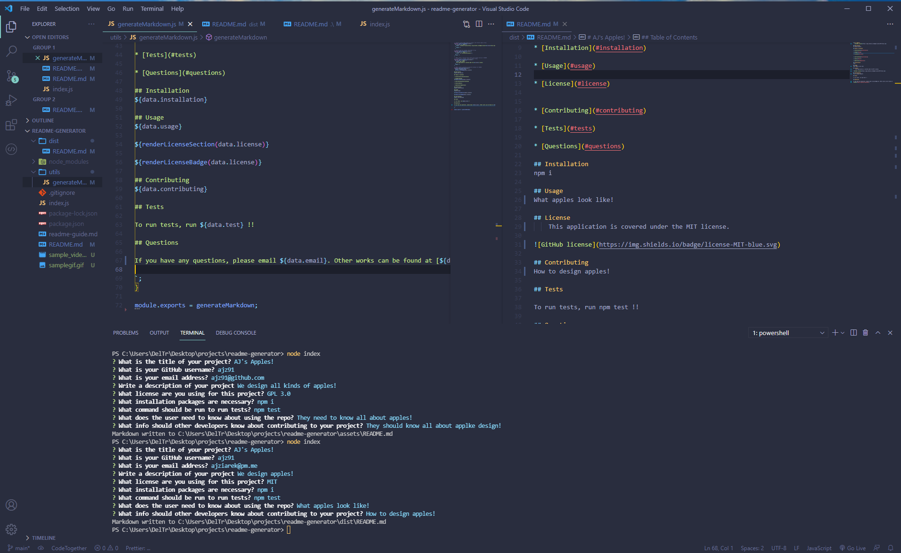

# README Generator

## Description

This application allows you to input information pertinent to creating a great README and writes a file to your computer for immediate use! Best of all, it is all done through the terminal using node.js! This app was created using 100% javascript!
  
## Usage

The user will be able to run the app using 'node index', input the required information, then have the README automatically generated! GIF included for additional clarity. An mp4 file is also included in the root of the folder (or on youtube https://www.youtube.com/watch?v=NE71M9BiUvw)

